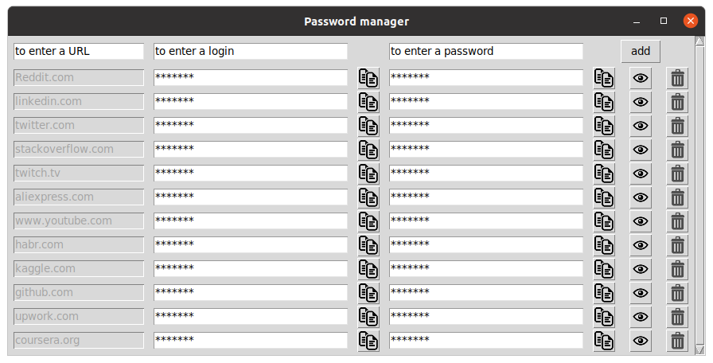

# Password-Manager
Программа Passwords manager сохраняет ваши пароли, и шифрует их с помощью алгоритма AES-256.
## Как пользоваться программой
При запуске программа запросит у вас мастер-пароль, с помощью которого она будет шифровать и расшифровывать ваши записи.

**Будьте внимательны! Если вы забудете ваш мастер-пароль, то утратите свои пароли!**
* Для добавления записи введите ваши логин, пароль и ресурс, и нажмите кнопку "add". После этого логин и пароль зашифруются и добавятся на экран.
* Для просмотра записей под звездочками, нажмите кнопку с глазом.
* Для удаления записи, нажмите кнопку с корзинкой.
* Для копирования необходимого поля в буфер обмена, необходимо нажать кнопку копирования соответствующую полю.

### Интерфейс программы

## Алгоритм работы программы
Программа на основе мастер-пароля введенного пользователем генерирует 32-байтный хеш, поскольку пароль для шифрования должен быть кратным восьми.
И уже на основании сгенерированного хеша шифрует логин и пароль алгоритмом AES с случайной солью, которая делает невозможным подбор зашифрованного пароля с помощью предварительно вычисленных таблиц.
